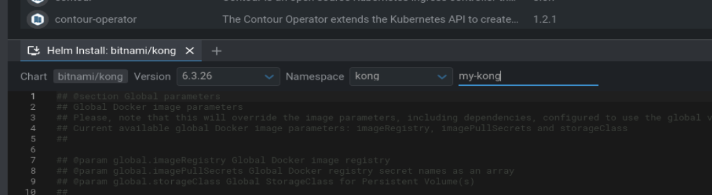

# Kubernetes

> Personal kubernetes web doc.
> Install, deploy app, dashboards, ...

Main Contacts:

- Thomas Plantain: thomas.plantain@gmail.com


## Table of Content
- [Kubernetes](#kubernetes)
  - [Table of Content](#table-of-content)
  - [Changelog](#changelog)
  - [Related Documents](#related-documents)
  - [Systems](#systems)
  - [Architecture de Kubernetes](#architecture-de-kubernetes)
  - [Features](#features)
    - [Install](#install)
    - [Kubernetes commands](#kubernetes-commands)
      - [micro8ks](#micro8ks)
      - [Kubectl](#kubectl)
    - [INGRESS](#ingress)
      - [ingress-bot-port](#ingress-bot-port)
      - [ingress-bot-path](#ingress-bot-path)
    - [Kubectl](#kubectl-1)
      - [Install kubectl localy](#install-kubectl-localy)
      - [Link Kubectl to microk8s](#link-kubectl-to-microk8s)
    - [Kubernetes Dashboard](#kubernetes-dashboard)
    - [Deployments](#deployments)
      - [Managing resources](#managing-resources)
    - [Charts](#charts)
    - [Helm](#helm)
    - [Lens](#lens)
    - [Octant](#octant)
    - [Argo](#argo)
    - [Kubernetes secret](#kubernetes-secret)
  - [Kong on Kubernetes](#kong-on-kubernetes)
    - [Install](#install-1)
    - [Check install](#check-install)
    - [Kong services and routes](#kong-services-and-routes)
      - [Create services](#create-services)
      - [Create routes](#create-routes)
      - [Add Auth key plugin](#add-auth-key-plugin)


## Changelog

| Date | Author | Modifications |
| --- | --- | --- |
| 01/07/2022 | Thomas | Init repo |
| 13/07/2022 | Thomas | Add kubectl commands |
| 20/07/2022 | Thomas | Dashboard screenshots |
| 29/07/2022 | Thomas | Lens Dashboard & Helm charts |
| 02/08/2022 | Thomas | Install Kong |


## Related Documents

| Name | Type | Description |
| --- | --- | --- |
| Microk8s | site web | [microk8s.io](https://microk8s.io/) |
| Kubernetes.io | site web | [kubernetes.io cheatsheet](https://kubernetes.io/fr/docs/reference/kubectl/cheatsheet/) |
| Helm.sh | site web | [Helm web site](https://helm.sh/) |
| Lens | site web | [Lens K8s dashoard](https://k8slens.dev/) |
| ArtifactHub | site web | [Kubernetes packages](https://artifacthub.io/) |
| Argo-cd | site web | [Kubernetes-native workflow engine](https://argoproj.github.io/) |
| Kong | site web | [Kong](https://konghq.com/) |
| Octant | Repo Github | [Octant](https://github.com/vmware-tanzu/octant) |
| Linkerd | site web | [Linkerd is a service mesh for Kubernetes](https://linkerd.io/2.11/overview/) |

## Systems

Here are the systems used

| System Name | Description |
| --- |  --- |
| Oracle Virtualbox | VM tools |
| Debian | Linux distro |
| micork8s | The lightweight Kubernetes  |
| Lens | Kubernetes dashboard |
| Helm | The package manager for Kubernetes |
| Kong | API Gateway |

## Architecture de Kubernetes


> Dans un cluster Kubernetes, il existe deux rôles de machines : le(s) nœud(s) maîtres(master) et le(s) nœud(s) de travail (workers).
Le(s) nœud maître exécute(ent) le plan de contrôle Kubernetes, qui est responsable de la gestion des workers, prend les décisions de planification et met en œuvre des modifications pour conduire le cluster à l'état souhaité.
Les workers, comme leur nom l’indique sont chargés de gérer les applications via des pods.

- [Introduction à Kubernetes](https://blog.stephane-robert.info/post/introduction-kubernetes/)


## Features

Features are:

- **Install microk8s**: {description}
- **Kubernetes commands**
- **Ingress presentation**: {description}.

In the following parts we will detail those features with the dependencies to each systems and the current considerations.

### Install

- First install snap
- Run snap install:

``sudo snap install microk8s --classic``

### Kubernetes commands

#### micro8ks

- link microk8s to /root/snap/bin/microk8s

- kubernetes status: 
``microk8s status``

- Dashboard

``microk8s dashboard-proxy``

- commands:
```
  microk8s status: Provides an overview of the MicroK8s state (running / not running) as well as the set of enabled addons
  microk8s enable: Enables an addon
  microk8s disable: Disables an addon
  microk8s kubectl: Interact with kubernetes
  microk8s config: Shows the kubernetes config file
  microk8s istioctl: Interact with the istio services; needs the istio addon to be enabled
  microk8s inspect: Performs a quick inspection of the MicroK8s intallation
  microk8s reset: Resets the infrastructure to a clean state
  microk8s stop: Stops all kubernetes services
  microk8s start: Starts MicroK8s after it is being stopped
```

#### Kubectl


- Create a microbot deployment with two pods via the kubectl cli
```
  microk8s kubectl create deployment microbot --image=dontrebootme/microbot:v1
  microk8s kubectl scale deployment microbot –replicas=2


  microk8s kubectl create deployment nginx –image=nginx
  microk8s kubectl scale deployment nginx –replicas=2
```


- To expose our deployment we need to create a service
```
  microk8s kubectl expose deployment microbot --type=NodePort --port=80 --name=microbot-service
  microk8s kubectl expose deployment nginx --type=NodePort --port=80 –name=nginx-service
```

- kubernetes list of components:

``microk8s kubectl get all``


- kubectl get

```
# Commandes Get avec un affichage basique
kubectl get services                     # Liste tous les services d'un namespace
kubectl get pods --all-namespaces        # Liste tous les Pods de tous les namespaces
kubectl get pods -o wide                 # Liste tous les Pods du namespace courant, avec plus de détails
kubectl get deployment my-dep            # Liste un déploiement particulier
kubectl get pods                         # Liste tous les Pods dans un namespace
kubectl get pod my-pod -o yaml           # Affiche le YAML du Pod
```

- kubectl describe

``microk8s kubectl describe pods nginx-xxxx``


- kubectl scale

```
kubectl scale --replicas=3 rs/foo     # Scale un replicaset nommé 'foo' à 3
```

### INGRESS
#### ingress-bot-port

```
  root@kube:~# cat /home/thomas/Documents/ingress-bot.yaml 
  apiVersion: networking.k8s.io/v1
  kind: Ingress
  metadata:
    name: test-ingress
  spec:
    defaultBackend:
      service:
        name: microbot-service
        port:
          number: 80
```


- create ingress rule: ``micro8ks kubectl create -f ingress-bot.yaml``
- Get ingress rules : ``micro8ks kubectl get ingress``

```
  root@kube:~# microk8s kubectl get ingress
  NAME           CLASS    HOSTS   ADDRESS   PORTS   AGE
  test-ingress   public   *                 80      39s
```

- http://127.0.0.1/


- ``micro8ks kubectl create -f ingress-bot-path.yaml``

- http://127.0.0.1/bot

```
  root@kube:/home/thomas/Documents# microk8s kubectl get ingress
  NAME           CLASS    HOSTS   ADDRESS     PORTS   AGE
  test-ingress   public   *       127.0.0.1   80      8d
  path-ingress   public   *                   80      14s
```

#### ingress-bot-path
```
  apiVersion: networking.k8s.io/v1
  kind: Ingress
  metadata:
    name: path-ingress
    annotations:
      nginx.ingress.kubernetes.io/rewrite-target: /
  spec:
    rules:
    - http:
        paths:
        - path: /bot
          pathType: Prefix
          backend:
            service:
              name: microbot-service
              port:
                number: 80
```


- Use command: ``microk8s ctr images list``

### Kubectl

#### Install kubectl localy
- [Install kubectl on linux](https://kubernetes.io/docs/tasks/tools/install-kubectl-linux/#install-using-native-package-management)


#### Link Kubectl to microk8s
- [Link microk8s and kubectl](https://microk8s.io/docs/working-with-kubectl)

```
cd $HOME
mkdir .kube
cd .kube
microk8s config > config
```


### Kubernetes Dashboard


### Deployments

> A Deployment provides declarative updates for Pods and ReplicaSets.

- ``kubectl get deployments``

#### Managing resources

> Many applications require multiple resources to be created, such as a Deployment and a Service. Management of multiple resources can be simplified by grouping them together in the same file (separated by --- in YAML).

- new namespace
- new service
- new deployment
- new ingress rule

**[see swag-ui.yaml](./deployments/swag-ui.yaml)**

### Charts

> Helm uses a packaging format called charts. A chart is a collection of files that describe a related set of Kubernetes resources. A single chart might be used to deploy something simple, like a memcached pod, or something complex, like a full web app stack with HTTP servers, databases, caches, and so on.

- [Public charts](https://github.com/helm/charts/tree/master/stable)
  
### Helm

- [Helm documentation](https://helm.sh/fr/docs/)


**Installation**
```
curl -fsSL -o get_helm.sh https://raw.githubusercontent.com/helm/helm/main/scripts/get-helm-3
chmod 700 get_helm.sh
./get_helm.sh
```
**create charts**
- ``helm create myService``

```
myService/
  Chart.yaml          # A YAML file containing information about the chart
  LICENSE             # OPTIONAL: A plain text file containing the license for the chart
  README.md           # OPTIONAL: A human-readable README file
  values.yaml         # The default configuration values for this chart
  values.schema.json  # OPTIONAL: A JSON Schema for imposing a structure on the values.yaml file
  charts/             # A directory containing any charts upon which this chart depends.
  crds/               # Custom Resource Definitions
  templates/          # A directory of templates that, when combined with values,
                      # will generate valid Kubernetes manifest files.
  templates/NOTES.txt # OPTIONAL: A plain text file containing short usage notes

```

**Install charts**


### Lens

- [Lens Kubernetes Dashboard](https://k8slens.dev/)


### Octant

> Another Kubernetes dashboard


### Argo

[Argo CD web site](https://argoproj.github.io/)

### Kubernetes secret

[Secret](https://kubernetes.io/docs/concepts/configuration/secret/)


## Kong on Kubernetes

### Install

- create namespace **kong**
- install with Lens 



### Check install


### Kong services and routes

#### Create services

```
curl -i -X POST http://10.1.42.188:8001/services --data 'name=mock' --data 'protocol=https' --data 'host=mockbin.org' --data 'port=443' --data 'path=/'
```

#### Create routes

```
curl -i -X POST http://10.1.42.188:8001/services/mock/routes --data 'name=mock1' --data 'paths[]=/mymock'
```


#### Add Auth key plugin

- Enable apikey for my route
  
```
curl -X POST http://10.1.42.188:8001/routes/mock1/plugins --data "name=key-auth" --data "config.key_names=apikey"
```

- Create a customer

```
curl -d "username=user123" http://10.1.42.188:8001/consumers/
```

- Create a key for this customer

```
curl -X POST http://10.1.42.188:8001/consumers/user123/key-auth
```
- Copy the key value

- List the apikeys

```
curl -X GET http://10.1.42.188:8001/key-auths
```

